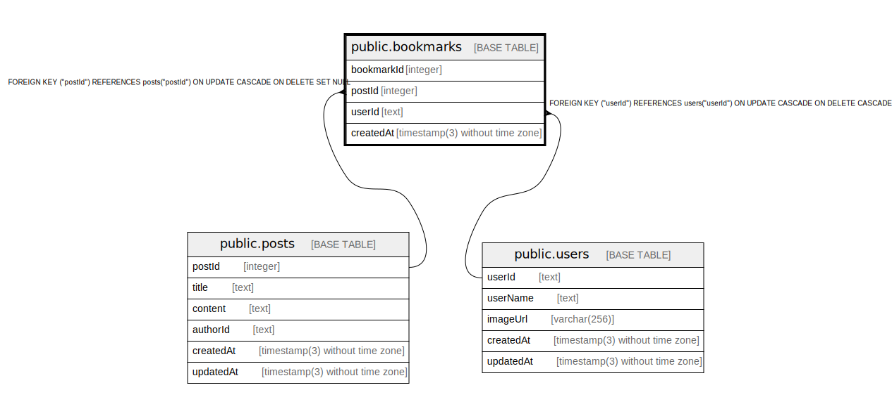

# public.bookmarks

## Description

## Columns

| Name | Type | Default | Nullable | Children | Parents | Comment |
| ---- | ---- | ------- | -------- | -------- | ------- | ------- |
| bookmarkId | integer | nextval('"bookmarks_bookmarkId_seq"'::regclass) | false |  |  |  |
| postId | integer |  | true |  | [public.posts](public.posts.md) |  |
| userId | text |  | false |  | [public.users](public.users.md) |  |
| createdAt | timestamp(3) without time zone | CURRENT_TIMESTAMP | false |  |  |  |

## Constraints

| Name | Type | Definition |
| ---- | ---- | ---------- |
| bookmarks_postId_fkey | FOREIGN KEY | FOREIGN KEY ("postId") REFERENCES posts("postId") ON UPDATE CASCADE ON DELETE SET NULL |
| bookmarks_pkey | PRIMARY KEY | PRIMARY KEY ("bookmarkId") |
| bookmarks_userId_fkey | FOREIGN KEY | FOREIGN KEY ("userId") REFERENCES users("userId") ON UPDATE CASCADE ON DELETE CASCADE |

## Indexes

| Name | Definition |
| ---- | ---------- |
| bookmarks_pkey | CREATE UNIQUE INDEX bookmarks_pkey ON public.bookmarks USING btree ("bookmarkId") |

## Relations

---

> Generated by [tbls](https://github.com/k1LoW/tbls)
