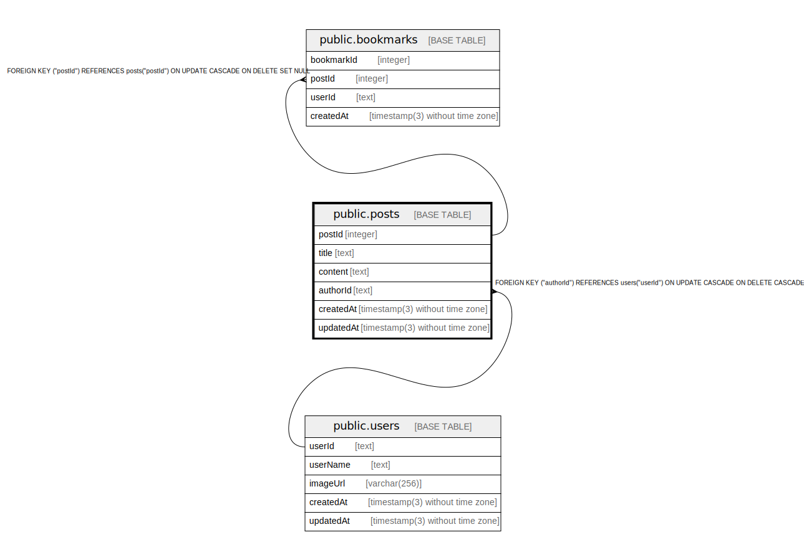

# public.posts

## Description

## Columns

| Name | Type | Default | Nullable | Children | Parents | Comment |
| ---- | ---- | ------- | -------- | -------- | ------- | ------- |
| postId | integer | nextval('"posts_postId_seq"'::regclass) | false | [public.bookmarks](public.bookmarks.md) |  |  |
| title | text |  | false |  |  |  |
| content | text |  | false |  |  |  |
| authorId | text |  | false |  | [public.users](public.users.md) |  |
| createdAt | timestamp(3) without time zone | CURRENT_TIMESTAMP | false |  |  |  |
| updatedAt | timestamp(3) without time zone |  | false |  |  |  |

## Constraints

| Name | Type | Definition |
| ---- | ---- | ---------- |
| posts_pkey | PRIMARY KEY | PRIMARY KEY ("postId") |
| posts_authorId_fkey | FOREIGN KEY | FOREIGN KEY ("authorId") REFERENCES users("userId") ON UPDATE CASCADE ON DELETE CASCADE |

## Indexes

| Name | Definition |
| ---- | ---------- |
| posts_pkey | CREATE UNIQUE INDEX posts_pkey ON public.posts USING btree ("postId") |

## Relations

---

> Generated by [tbls](https://github.com/k1LoW/tbls)
