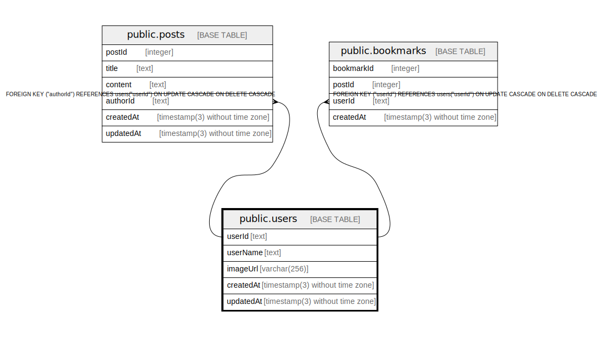

# public.users

## Description

## Columns

| Name | Type | Default | Nullable | Children | Parents | Comment |
| ---- | ---- | ------- | -------- | -------- | ------- | ------- |
| userId | text |  | false | [public.posts](public.posts.md) [public.bookmarks](public.bookmarks.md) |  |  |
| userName | text |  | false |  |  |  |
| imageUrl | varchar(256) |  | true |  |  |  |
| createdAt | timestamp(3) without time zone | CURRENT_TIMESTAMP | false |  |  |  |
| updatedAt | timestamp(3) without time zone |  | false |  |  |  |

## Constraints

| Name | Type | Definition |
| ---- | ---- | ---------- |
| users_pkey | PRIMARY KEY | PRIMARY KEY ("userId") |

## Indexes

| Name | Definition |
| ---- | ---------- |
| users_userName_key | CREATE UNIQUE INDEX "users_userName_key" ON public.users USING btree ("userName") |
| users_pkey | CREATE UNIQUE INDEX users_pkey ON public.users USING btree ("userId") |

## Relations

---

> Generated by [tbls](https://github.com/k1LoW/tbls)
